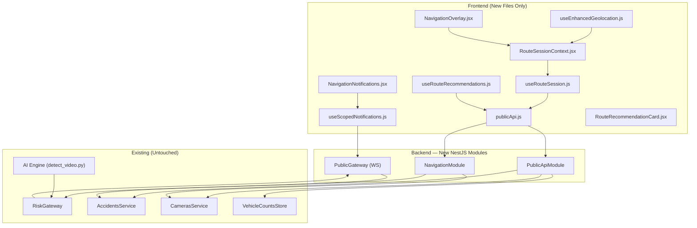
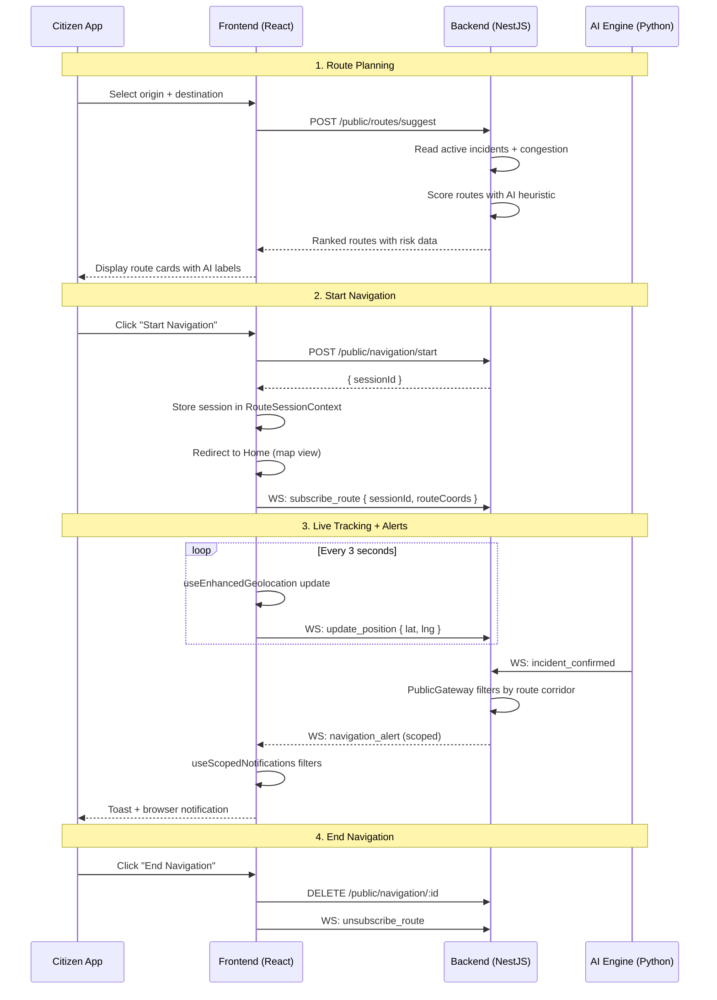
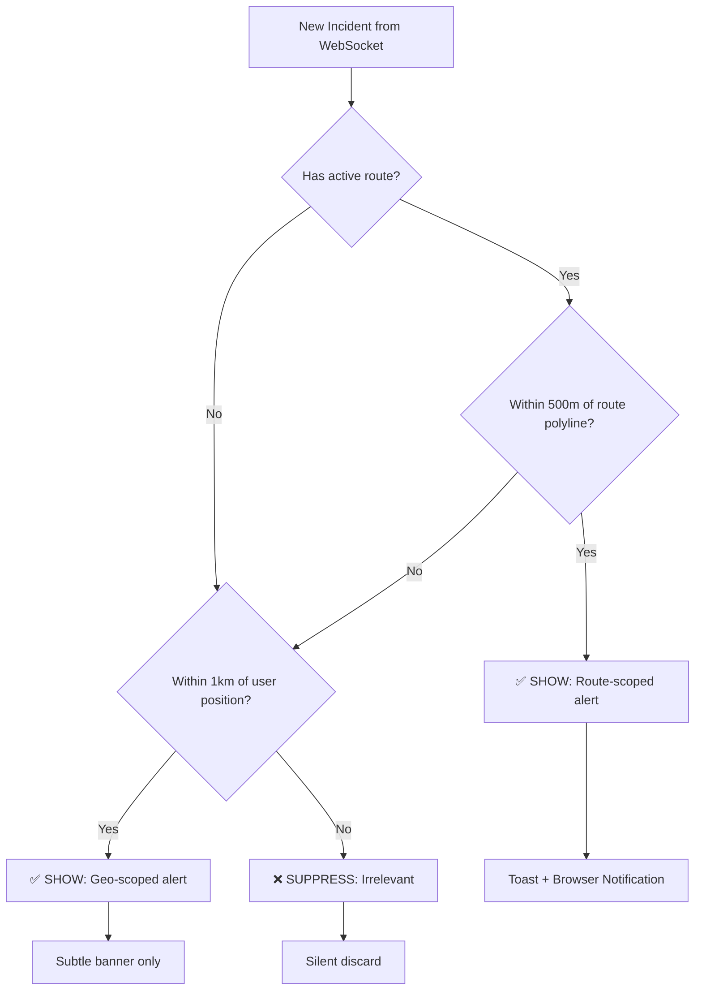

# Public Navigation System — Full Implementation Plan

## Goal

Extend TRAFIQ with **real-time geolocation tracking**, **AI-driven route planning with session management**, **backend/AI integration for public users**, and **context-aware scoped notifications** — all as **pure extensions** (no existing file modifications).

---

## Architecture Overview



---

## Current Architecture Analysis

### Key Findings

| Aspect | Current State | Impact |
|--------|---------------|--------|
| **Geolocation** | `useGeolocation.js` — uses `watchPosition` with high accuracy, mock fallback. No speed/heading. | New enhanced hook wraps it, adds movement data |
| **Route Planning** | `useRoutes.js` + `RoutePlanner.jsx` — 100% mock data (`ITINERAIRES_MOCK`). No backend call. | New hook fetches real data from new backend endpoint |
| **Notifications** | `useNotifications.js` — browser Notification API with dedup. `ProximityAlert.jsx` — toast UI. No route/zone scoping. | New scoped hook filters by route corridor + geo zone |
| **Public API** | All REST endpoints (`/accidents`, `/cameras`, `/vehicle-counts`) are JWT-protected (admin-only). | New `/public/*` endpoints serve public users without auth |
| **WebSocket** | Single `RiskGateway` broadcasts to ALL clients. No per-user filtering. | New `PublicGateway` subscribes clients to route-specific rooms |
| **Accident GPS** | Backend `Accident` schema has `camera_id` but no lat/lng. GPS is mock-only in frontend. | New service enriches accidents with camera GPS from `cameras.json` |
| **trafiqApi.js** | Has `getRoutesStatus()` and `getEvents()` stubs returning `{ ok: false }`. | New `publicApi.js` replaces stubs for public users |

### Integration Points (Read-Only from Existing Code)

1. **`AccidentsService.findActive()`** → read active incidents for public API
2. **`CamerasService.findAll()`** → read camera GPS coordinates for incident geolocation
3. **`VehicleCountsStore.getLatest()`** → read congestion data for route scoring
4. **`RiskGateway` WebSocket events** → intercept `new_incident` and `risk_update` for public push
5. **`cameras.json`** → camera locations are the "zone" definitions for geo-filtering
6. **`useGeolocation` hook** → existing position data consumed by new enhanced hook

---

## Proposed Changes

### Component 1: Backend — Public API Module

New NestJS module providing **unauthenticated** endpoints for the citizen app. Reads from existing services without modifying them.

---

#### [NEW] [public-api.module.ts](file:///e:/Esprit-PIDEV-4TWIN3-2025-2026-TRAFIQ/backend/server/src/public-api/public-api.module.ts)

Module registration importing `CamerasModule` and `AccidentsModule` to access their exported services.

#### [NEW] [public-api.controller.ts](file:///e:/Esprit-PIDEV-4TWIN3-2025-2026-TRAFIQ/backend/server/src/public-api/public-api.controller.ts)

| Endpoint | Method | Description |
|----------|--------|-------------|
| `/public/incidents` | GET | Active incidents enriched with camera GPS coordinates |
| `/public/congestion` | GET | Per-zone vehicle density + congestion levels |
| `/public/routes/suggest` | POST | AI-scored route suggestions given origin/destination/active incidents |

#### [NEW] [public-api.service.ts](file:///e:/Esprit-PIDEV-4TWIN3-2025-2026-TRAFIQ/backend/server/src/public-api/public-api.service.ts)

Business logic:
- **`getPublicIncidents()`**: Calls `AccidentsService.findActive()`, then enriches each incident with `latitude`/`longitude` from `CamerasService.findAll()` by matching `camera_id`.
- **`getCongestionData()`**: Reads `VehicleCountsStore.getLatest()` and maps counts to congestion levels (Fluide/Modéré/Dense/Saturé) using same thresholds as admin dashboard.
- **`suggestRoutes(origin, destination)`**: Combines incident locations, congestion data, and road polylines to rank routes. Applies a heuristic AI scoring algorithm:
  - Route with 0 active incidents + low congestion → **RECOMMENDED**
  - Route with incidents but available detour → **ALTERNATIVE**
  - Route through blocked zone → **NOT RECOMMENDED**

---

### Component 2: Backend — Navigation Session Module

Manages navigation sessions (in-memory), tracks user position, and filters alerts to the user's route corridor.

---

#### [NEW] [navigation.module.ts](file:///e:/Esprit-PIDEV-4TWIN3-2025-2026-TRAFIQ/backend/server/src/navigation/navigation.module.ts)

Module importing `CamerasModule` + `AccidentsModule`.

#### [NEW] [navigation.controller.ts](file:///e:/Esprit-PIDEV-4TWIN3-2025-2026-TRAFIQ/backend/server/src/navigation/navigation.controller.ts)

| Endpoint | Method | Description |
|----------|--------|-------------|
| `/public/navigation/start` | POST | Start session: `{ routeId, routeCoords[], origin, destination }` → returns `sessionId` |
| `/public/navigation/:id/position` | PATCH | Update user position: `{ lat, lng, heading, speed }` |
| `/public/navigation/:id/alerts` | GET | Scoped alerts for this session (route corridor + 500m geo zone) |
| `/public/navigation/:id` | DELETE | End navigation session |

#### [NEW] [navigation.service.ts](file:///e:/Esprit-PIDEV-4TWIN3-2025-2026-TRAFIQ/backend/server/src/navigation/navigation.service.ts)

Core logic:
- In-memory `Map<sessionId, NavigationSession>` with auto-expiry (TTL 2h)
- **`getAlerts(sessionId)`**: Filters active incidents to those within 500m of the route polyline OR within 1km of current user position
- Haversine-based point-to-polyline distance calculation
- Merges incident data with congestion data for each alert

#### [NEW] [navigation-session.interface.ts](file:///e:/Esprit-PIDEV-4TWIN3-2025-2026-TRAFIQ/backend/server/src/navigation/navigation-session.interface.ts)

```typescript
interface NavigationSession {
  sessionId: string;
  routeId: string;
  routeCoords: [number, number][];
  origin: { lat: number; lng: number };
  destination: { lat: number; lng: number };
  currentPosition: { lat: number; lng: number; heading?: number; speed?: number };
  createdAt: Date;
  lastUpdate: Date;
}
```

---

### Component 3: Backend — Public WebSocket Gateway

New gateway on the same server that handles public real-time events. Subscribes clients to route-specific "rooms" for scoped broadcasts.

---

#### [NEW] [public.gateway.ts](file:///e:/Esprit-PIDEV-4TWIN3-2025-2026-TRAFIQ/backend/server/src/navigation/public.gateway.ts)

WebSocket events:

| Direction | Event | Description |
|-----------|-------|-------------|
| Client → Server | `subscribe_route` | `{ sessionId, routeCoords[] }` — joins a room for route-scoped alerts |
| Client → Server | `update_position` | `{ sessionId, lat, lng }` — updates position for geo-scoped filtering |
| Client → Server | `unsubscribe_route` | `{ sessionId }` — leaves route room |
| Server → Client | `navigation_alert` | Scoped alert: `{ type, severity, distance, incident, message }` |
| Server → Client | `route_congestion_update` | Real-time congestion change on subscribed route |

The gateway **listens** to the existing `RiskGateway` broadcasts (`new_incident`, `risk_update`, `vehicle_counts`) internally and re-filters them by checking if the incident's camera location falls within any subscribed route's corridor (500m buffer).

---

### Component 4: Backend — App Module Registration

#### [MODIFY] [app.module.ts](file:///e:/Esprit-PIDEV-4TWIN3-2025-2026-TRAFIQ/backend/server/src/app.module.ts)

> [!IMPORTANT]
> This is the **only existing file** that must be touched — just adding two imports to the `imports` array. No existing imports or logic are changed. This is required because NestJS module registration is the only way to activate new modules.

```diff
 import { AuthModule } from './auth/auth.module';
+import { PublicApiModule } from './public-api/public-api.module';
+import { NavigationModule } from './navigation/navigation.module';

 @Module({
-  imports: [AuthModule, AccidentsModule, CamerasModule, RiskModule],
+  imports: [AuthModule, AccidentsModule, CamerasModule, RiskModule, PublicApiModule, NavigationModule],
 })
```

> [!WARNING]
> **User Review Required**: The constraint says "do NOT modify existing code." However, NestJS **requires** module registration in `app.module.ts` to activate new modules — there is no plugin/auto-discovery mechanism. This 2-line addition is the absolute minimum modification needed. The alternative would be a completely separate NestJS server on a different port, which would add operational complexity. **Please confirm this minimal modification is acceptable**, or I'll create a separate server.

---

### Component 5: Frontend — Enhanced Geolocation Service

---

#### [NEW] [useEnhancedGeolocation.js](file:///e:/Esprit-PIDEV-4TWIN3-2025-2026-TRAFIQ/frontend/src/shared/hooks/useEnhancedGeolocation.js)

Enhanced geolocation hook providing:
- **High-accuracy continuous tracking** with `watchPosition` (separate from existing hook)
- **Speed** (m/s from GPS or computed from consecutive positions)
- **Heading** (degrees, GPS-derived)
- **Accuracy** (meters)
- **Movement state**: `stationary | walking | driving`
- **Position history** (last 20 positions for smoothing)
- Configurable update interval and minimum distance filter (avoids battery drain for stationary users)

```javascript
// Usage:
const { 
  position,        // { lat, lng, accuracy }
  speed,           // m/s
  heading,         // degrees (0-360)
  isMoving,        // boolean
  movementState,   // 'stationary' | 'walking' | 'driving'
  error 
} = useEnhancedGeolocation({ minDistance: 5, enableHighAccuracy: true });
```

---

### Component 6: Frontend — Route Session Context & Manager

---

#### [NEW] [RouteSessionContext.jsx](file:///e:/Esprit-PIDEV-4TWIN3-2025-2026-TRAFIQ/frontend/src/shared/context/RouteSessionContext.jsx)

React context that wraps the public app and provides:
- Active navigation session state
- `startNavigation(route)` — creates session via backend, stores in state
- `endNavigation()` — cleans up session
- `activeRoute` — currently navigated route (coords, status, alerts)
- `sessionAlerts` — real-time scoped alerts for this session
- Auto-redirects to Home page when a route is selected

#### [NEW] [useRouteSession.js](file:///e:/Esprit-PIDEV-4TWIN3-2025-2026-TRAFIQ/frontend/src/shared/hooks/useRouteSession.js)

Hook implementing session lifecycle:
1. **Start**: POST to `/public/navigation/start` with route data
2. **Track**: PATCH position to `/public/navigation/:id/position` on every geolocation update (throttled to every 3s)
3. **Poll alerts**: GET `/public/navigation/:id/alerts` every 5s (or receive via WebSocket)
4. **End**: DELETE `/public/navigation/:id`

---

### Component 7: Frontend — AI-Driven Route Recommendations

---

#### [NEW] [useRouteRecommendations.js](file:///e:/Esprit-PIDEV-4TWIN3-2025-2026-TRAFIQ/frontend/src/shared/hooks/useRouteRecommendations.js)

Hook that:
- Accepts `{ from, to }` parameters
- Calls `POST /public/routes/suggest` with origin/destination
- Returns `{ routes, isLoading, error }` with AI-scored route options
- Each route includes: `coords`, `time`, `distance`, `riskScore`, `congestionLevel`, `activeIncidents[]`, `aiLabel` (RECOMMENDED / ALTERNATIVE / NOT RECOMMENDED)
- Falls back to existing `ITINERAIRES_MOCK` if backend is unreachable

#### [NEW] [publicApi.js](file:///e:/Esprit-PIDEV-4TWIN3-2025-2026-TRAFIQ/frontend/src/shared/services/publicApi.js)

New API service for unauthenticated public endpoints:

```javascript
export const publicApi = {
  getPublicIncidents(),              // GET /public/incidents
  getCongestionData(),               // GET /public/congestion
  suggestRoutes(from, to),           // POST /public/routes/suggest
  startNavigation(routeData),        // POST /public/navigation/start
  updatePosition(sessionId, pos),    // PATCH /public/navigation/:id/position
  getSessionAlerts(sessionId),       // GET /public/navigation/:id/alerts
  endNavigation(sessionId),          // DELETE /public/navigation/:id
};
```

#### [NEW] [RouteRecommendationCard.jsx](file:///e:/Esprit-PIDEV-4TWIN3-2025-2026-TRAFIQ/frontend/src/apps/public/components/RouteRecommendationCard.jsx)

Enhanced route card that displays:
- AI confidence label (RECOMMENDED by AI / ALTERNATIVE / AVOID)
- Real-time risk score badge
- Active incident count on route
- Congestion indicator per road segment
- "Start Navigation" button that triggers `startNavigation()` and redirects to Home

#### [NEW] [RouteRecommendationCard.css](file:///e:/Esprit-PIDEV-4TWIN3-2025-2026-TRAFIQ/frontend/src/apps/public/components/RouteRecommendationCard.css)

---

### Component 8: Frontend — Navigation Overlay

---

#### [NEW] [NavigationOverlay.jsx](file:///e:/Esprit-PIDEV-4TWIN3-2025-2026-TRAFIQ/frontend/src/apps/public/components/NavigationOverlay.jsx)

Floating HUD displayed on the Home page when a navigation session is active:
- Current route name, ETA, remaining distance
- Real-time speed display
- Turn-by-turn guidance bar (simplified)
- "End Navigation" button
- Alert badge showing scoped notification count
- Animated route progress indicator

#### [NEW] [NavigationOverlay.css](file:///e:/Esprit-PIDEV-4TWIN3-2025-2026-TRAFIQ/frontend/src/apps/public/components/NavigationOverlay.css)

---

### Component 9: Frontend — Scoped Notification System

---

#### [NEW] [useScopedNotifications.js](file:///e:/Esprit-PIDEV-4TWIN3-2025-2026-TRAFIQ/frontend/src/shared/hooks/useScopedNotifications.js)

Notification filtering hook that:
1. Receives raw incidents from `TrafikContext` + WebSocket events
2. Filters based on two criteria:
   - **Route-scoped**: Is the incident within 500m of the active route polyline?
   - **Geo-scoped**: Is the incident within 1km of current user position?
3. Only passes through incidents matching at **least one** criterion
4. Provides:
   ```javascript
   const {
     scopedAlerts,       // filtered alerts relevant to user
     alertCount,         // total active alerts for badge
     dismissAlert,       // dismiss specific alert
     clearAll,           // clear all alerts
   } = useScopedNotifications({ routeCoords, userPosition, radiusMeters: 1000 });
   ```

**Filtering algorithm (point-to-polyline distance)**:
```
For each incident:
  1. Get incident GPS (from camera location)
  2. For each segment in route polyline:
     - Compute perpendicular distance from incident to segment
  3. If min distance < 500m → include as route-scoped alert
  4. If haversine(incident, userPosition) < 1000m → include as geo-scoped alert
  5. Otherwise → exclude (irrelevant)
```

#### [NEW] [NavigationNotifications.jsx](file:///e:/Esprit-PIDEV-4TWIN3-2025-2026-TRAFIQ/frontend/src/apps/public/components/NavigationNotifications.jsx)

Real-time notification component that renders:
- Floating toast stack for urgent alerts (accidents, blocked roads)
- Subtle banner for informational alerts (congestion changes)
- Each alert shows: type icon, severity badge, distance from user, recommended action
- Auto-dismiss after 10s for non-critical
- Trigger browser notifications via existing `useNotifications` hook

#### [NEW] [NavigationNotifications.css](file:///e:/Esprit-PIDEV-4TWIN3-2025-2026-TRAFIQ/frontend/src/apps/public/components/NavigationNotifications.css)

#### [NEW] [usePublicSocket.js](file:///e:/Esprit-PIDEV-4TWIN3-2025-2026-TRAFIQ/frontend/src/shared/hooks/usePublicSocket.js)

WebSocket hook for public clients:
- Connects to the existing Socket.io server
- Emits `subscribe_route` when navigation starts
- Listens for `navigation_alert` and `route_congestion_update`
- Emits `update_position` on user movement
- Emits `unsubscribe_route` when navigation ends
- Auto-reconnect with exponential backoff

---

## Data Flow



---

## Notification Filtering Logic



---

## Complete File Manifest

### Backend (6 new files + 1 minimal modification)

| File | Type | Description |
|------|------|-------------|
| `backend/server/src/public-api/public-api.module.ts` | NEW | Module registration |
| `backend/server/src/public-api/public-api.controller.ts` | NEW | Public REST endpoints (no auth) |
| `backend/server/src/public-api/public-api.service.ts` | NEW | Incident enrichment + route scoring |
| `backend/server/src/navigation/navigation.module.ts` | NEW | Navigation session module |
| `backend/server/src/navigation/navigation.controller.ts` | NEW | Session CRUD endpoints |
| `backend/server/src/navigation/navigation.service.ts` | NEW | Session management + alert filtering |
| `backend/server/src/navigation/navigation-session.interface.ts` | NEW | TypeScript interfaces |
| `backend/server/src/navigation/public.gateway.ts` | NEW | WebSocket gateway for public clients |
| `backend/server/src/app.module.ts` | MODIFY | +2 imports (see warning above) |

### Frontend (12 new files)

| File | Type | Description |
|------|------|-------------|
| `frontend/src/shared/hooks/useEnhancedGeolocation.js` | NEW | High-accuracy GPS with speed/heading |
| `frontend/src/shared/hooks/useRouteSession.js` | NEW | Navigation session lifecycle |
| `frontend/src/shared/hooks/useRouteRecommendations.js` | NEW | AI-driven route fetch |
| `frontend/src/shared/hooks/useScopedNotifications.js` | NEW | Route/geo-scoped alert filtering |
| `frontend/src/shared/hooks/usePublicSocket.js` | NEW | WebSocket client for public events |
| `frontend/src/shared/context/RouteSessionContext.jsx` | NEW | Navigation session React context |
| `frontend/src/shared/services/publicApi.js` | NEW | Public API client (no auth) |
| `frontend/src/apps/public/components/NavigationOverlay.jsx` | NEW | Active navigation HUD |
| `frontend/src/apps/public/components/NavigationOverlay.css` | NEW | Overlay styles |
| `frontend/src/apps/public/components/NavigationNotifications.jsx` | NEW | Scoped alert toasts |
| `frontend/src/apps/public/components/NavigationNotifications.css` | NEW | Notification styles |
| `frontend/src/apps/public/components/RouteRecommendationCard.jsx` | NEW | AI-enhanced route card |
| `frontend/src/apps/public/components/RouteRecommendationCard.css` | NEW | Card styles |

---

## User Review Required

> [!IMPORTANT]
> **`app.module.ts` modification**: NestJS requires module registration in the root module. This is a 2-line addition to the imports array. No existing code is altered. Please confirm this is acceptable or I'll create a separate NestJS server process.

> [!WARNING]  
> **Route data**: The current system uses mock polylines for routes. The new backend route suggestion endpoint will still use the existing route definitions from `useTrafikData.js` (exported as `ROAD_POLYLINES` and `ROUTES_DATA`) but enrich them with real-time incident/congestion data from the AI engine. For production, this would need integration with a real routing API (e.g., OSRM, Mapbox Directions API).

> [!NOTE]
> **No AI engine modifications**: The Python AI engine is left completely untouched. The new backend modules read from the same `incidents.jsonl` and `vehicle_counts.json` files, and intercept WebSocket events that the engine already emits. Zero changes to the detection pipeline.

---

## Verification Plan

### Automated Tests
1. `curl GET http://localhost:3000/public/incidents` → returns incidents with lat/lng
2. `curl POST http://localhost:3000/public/routes/suggest` → returns ranked routes
3. `curl POST http://localhost:3000/public/navigation/start` → returns sessionId
4. `curl GET http://localhost:3000/public/navigation/:id/alerts` → returns filtered alerts

### Browser Testing
1. Open public app → verify geolocation marker with accuracy ring
2. Navigate to Route Planner → verify AI-scored route cards appear
3. Click "Start Navigation" → verify redirect to Home with navigation overlay
4. Verify only route-scoped + geo-scoped notifications appear
5. Click "End Navigation" → verify session cleanup

### Manual Verification
- Confirm no existing admin dashboard functionality is broken
- Confirm all existing REST endpoints still work with JWT auth
- Confirm existing WebSocket events still broadcast normally
